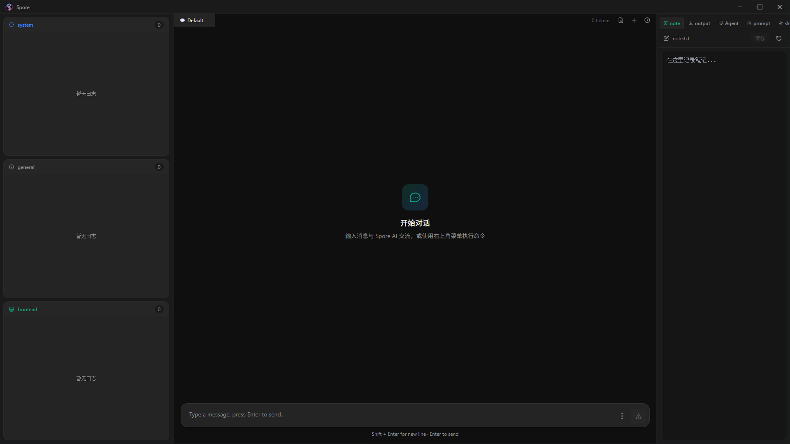

  
  
  # Spore AI Agent
  
  **具有现代GUI透明可控的万能 AI Agent | 在主机上完成任何任务**
  
  不只是写代码 - 文档处理、逆向分析、网络流量解析、文件管理、系统操作...
  
  实时监控每一步决策和工具调用，随时调整配置。
  
  让 AI 成为你的全能助手，而不仅仅是代码生成器。
  
  **✨ Windows 平台原生支持 | 一键安装部署 | 开箱即用**
  
  ---
  
  📖 [配置说明](docs/CONFIGURATION.md) | 💻 [CLI 模式](docs/CLI.md) | 🔨 [构建指南](docs/BUILD.md) | 🎯 [技能开发](docs/SKILLS.md) | 🏗️ [架构设计](docs/ARCHITECTURE.md) | 🎨 [前端指南](docs/FRONTEND.md) | 📦 [Release](https://github.com/miunasu/Spore/releases)

---

## 界面预览

  
  
<i>让你完全掌控整个流程</i>

---

## 为什么选择 Spore？

### 🖥️ 现代化桌面 GUI - 专业的可视化界面

告别命令行黑窗口，Spore 提供完整的桌面应用体验。

**直观易用的图形界面：**

- **多标签页设计**：对话与文件编辑无缝切换，拖拽文件即可打开编辑器
- **实时监控面板**：消息详情展开、TODO 任务栏、确认栏、日志面板一目了然
- **流式显示**：WebSocket 实时推送，Token 计数实时显示
- **一键安装**：Windows 原生安装包，开箱即用

**专业工具的专业界面，让复杂操作变得简单。**

### 🔍 透明可控 - 看得见的 AI

大多数 AI Agent 是黑盒：你不知道它在想什么，不知道它调用了什么工具，出错了也不知道哪里出了问题。

**Spore 让一切透明：**

- **实时监控**：每条消息都可展开查看完整的工具调用记录（ACTION/RESULT）
- **独立日志**：系统事件和 Agent 行为全部记录，多 Agent 协作时每个子 Agent 有独立监控窗口
- **危险操作确认**：删除、覆盖文件前必须经过你的确认，显示详细文件列表
- **随时中断**：Ctrl+C 或停止按钮，随时打断 Agent 执行
- **动态调整**：实时切换上下文模式、角色、技能，无需重启

**你不再是旁观者，而是掌控者。**

### 🌟 万能 Agent - 不只是代码助手

大多数 AI 能很好的帮你编写代码，但你的工作远不止于此。

**Spore 是真正的主机级全能助手：**

- **📝 文档处理**：解析和生成 PDF、Word、PowerPoint 文档，甚至你可以提供模板和原始数据，让Spore处理数据并按照原格式帮你写报告。
- **🔍 逆向分析**：集成 IDA Pro，自动化二进制分析和漏洞挖掘 [银狐、ShadyPanda恶意样本分析](example/MalwareAnalysis/)
- **🌐 网络分析**：解析 PCAP 流量包，提取关键信息 [Remcos、Mirai Pcap分析](example/PcapAnalysis/)
- **📊 数据分析**：自动收集网络数据、处理分析、生成可视化报告 [2025-2026全球金融市场综合分析报告](example/MarketReport/)
- **💾 文件操作**：搜索、读写、批量处理本地文件
- **⚙️ 系统管理**：执行命令、管理进程、自动化运维任务
- **💻 代码开发**：当然，也能写代码、调试、重构

**从日常办公到专业领域工作，一个 Agent 搞定所有任务。**

---

## 核心特性

### 🎯 智能上下文模式

- **强上下文模式**：保留完整对话历史，适合需要精确推理和上下文强关联的任务，Spore会倾向于单agent行动
- **长上下文模式**：优化大文本处理，适合大项目编程和文档分析，Spore会倾向于多agent协作
- **自动模式**：根据任务类型自动判断并切换最佳模式
- 运行时动态切换，无需重启

### 🤖 多 Agent 协作

- 主 Agent 派发任务，子 Agent 并发执行
- 每个子 Agent 拥有独立监控终端窗口
- 自动检测循环和死锁，智能终止无效任务

### 🧩 Claude Skils 扩展系统

- **内置专业技能**：IDA Pro 逆向分析、PDF/DOCX/PPTX 文档处理、PCAP 网络流量分析
- **主机操作能力**：文件搜索、命令执行、进程管理、批量文件处理
- **动态加载**：按需查询技能文档，不占用上下文
- **易于扩展**：遵循规范即可添加自定义技能包

### 🎭 角色切换系统

- 预定义专业角色：恶意代码分析师、Python 专家、数据分析师等
- 自动推荐适合当前任务的角色
- 支持自定义角色（添加 Markdown 文件即可）

### 🔧 文本协议交互

- 不依赖 OpenAI Function Calling，使用自定义文本协议
- 跨 SDK 兼容（OpenAI、Anthropic等）
- 可读性强，便于调试和日志分析

---

## 快速开始

### 1. 下载安装（推荐）

从 [Release 页面](https://github.com/miunasu/Spore/releases) 下载安装包，一键安装即可。

### 2. 配置 API

启动后点击右侧"设置"按钮，在"环境配置"页面填写 LLM API Key。

或者直接编辑 `.env` 文件，填写配置。

### 3. 开始使用

输入消息与 Spore AI 交流，Spore会完成你的一切任务。

---

## 技术栈

- **后端**：Python + FastAPI + WebSocket
- **前端**：React + TypeScript + Vite + Tauri
- **LLM**：支持 OpenAI、Anthropic、DeepSeek 等
- **协议**：自定义文本协议（不依赖 Function Calling）

---

## 系统要求

- Windows 10/11（主要支持）
- Python 3.10+（从源码运行）

---

## 构建与依赖

### 必需环境（源码运行/构建）

- Python 3.10+
- uv（Python 依赖同步与运行管理）
- Node.js 18.x / 20.x LTS
- Rust + Cargo
- Visual Studio Build Tools（Windows，含 C++ 工具链）

### 外部工具说明

- `rg.exe`：不再放在仓库中。`build_installer.bat` 会在构建时自动下载、校验（SHA256）并打包到安装目录，终端用户无需手动安装。
- `NSIS`：用于生成 Windows 安装包（setup.exe），由 Tauri 的 `nsis` 打包目标使用。
- `UPX`：在 `spore_backend.spec` 中用于 PyInstaller 压缩后端可执行文件，非基础运行必需。

---

## 许可证

**CC BY-NC 4.0 (署名-非商业性使用 4.0 国际)**

本项目采用知识共享署名-非商业性使用 4.0 国际许可协议进行许可。

✅ **允许**：个人学习、研究、教学等非营利性使用  
❌ **禁止**：任何形式的商业使用（包括但不限于企业内部使用、提供付费服务、集成到商业产品等）

如需商业使用许可，请联系项目作者。

详见 [LICENSE](LICENSE) 文件

---

  
**Spore AI Agent** - 透明可控，让你真正掌控 AI 🚀

[GitHub](https://github.com/miunasu/Spore) | [文档](docs/) | [Release](https://github.com/miunasu/Spore/releases)

