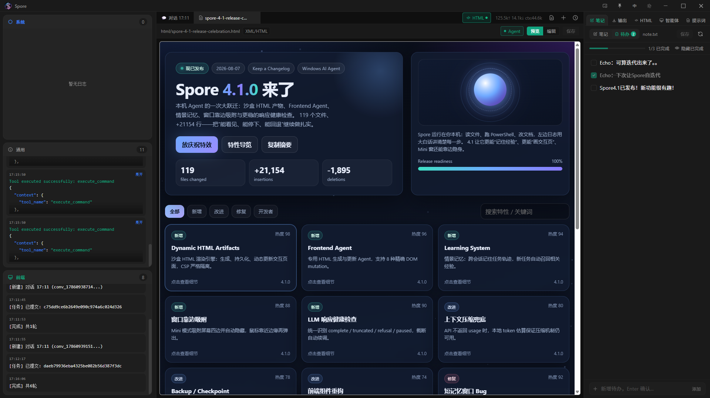

<div align="center">
  

# Spore AI Agent

### Let AI do real work on your actual Windows PC — while you always see it, can stop it, and can undo it

**Host-level general agent · Zero-friction desktop GUI · Model-agnostic · Safety guardrails · File time machine · Open source & auditable**

[Download Release](https://github.com/miunasu/Spore/releases) · [中文 README](README_zh.md) · [Configuration](docs/en/CONFIGURATION.md) · [Architecture](docs/en/ARCHITECTURE.md) · [Build Guide](docs/en/BUILD.md)

</div>

> **Note on language:** Spore's desktop UI is currently in Chinese; English localization (i18n) is on the roadmap. The AI agent itself replies in **the language you write in** — ask in English and it answers in English. This README and the core docs are in English.

---

<div align="center">
  
</div>

---

# 1. Why Spore

## Handing your real computer to an AI is scary — unless you can see it, stop it, and undo it

Today's AI agents are getting smarter, but most of them live in a cage: coding agents can't leave the workspace, cloud agents can't touch your local files or software, and nearly every tool trades away real capability for the safety of a sandbox. It's not that they *can't* do things — they're just **not allowed to do the real work**.

Spore takes the opposite path: **it runs on your machine and can touch real files, real commands, real system tools** — but it doesn't buy safety by forbidding access. It gives real host-level capability a full control system to stand on.

> Other agents protect you with a sandbox — at the cost of not doing real work.
> Spore protects you with guardrails — so it dares to work on a real machine.

Those guardrails are the three promises in the tagline:

| | Capability | What you get |
|---|---|---|
| 👁️ **See it** | Plain-language command intent, TODO progress, sub-agent monitor, expandable raw model context | Even if you don't know the command line, you know what the AI is doing and whether it's off track |
| ✋ **Stop it** | One-click stop, high-risk confirmation, automatic circuit-breaker on malicious behavior | Interrupt anytime; risky actions need your nod; malicious actions get cut off automatically |
| ⏪ **Undo it** | Git-independent file version history, conversation-point rewind | Recover from wrong edits or deletions — and even the "restore" itself can be undone |

## Not code-only: a host-level general agent

Spore is a **host-level general agent** — not code-only. This is exactly what sets it apart from tools like Cursor, Claude Code, and Codex: it takes on the work across your entire computer, not just one code project.

| Scenario | Typical work |
|---|---|
| 💻 Coding | Write, debug, refactor, diagnose, split project tasks concurrently |
| 📝 Docs & office | Read and generate Word / PDF / PPT, produce data-driven reports |
| 📊 Research | Web research, gather material, generate analysis reports |
| 💾 File management | Search, read, batch-edit, archive local files ("sort my Downloads by project") |
| ⚙️ System admin | Run PowerShell, install dependencies, check services and config |
| 🔍 Security analysis | Malware, traffic and forensics analysis alongside local toolchains |
| 🌐 Traffic forensics | Analyze PCAPs, identify C2 communication, generate detection leads |

The repo ships with several **real task reproductions**, not toy demos:

- `example/MalwareAnalysis/` — SilverFox and other sample analyses ([walkthrough](docs/en/SILVERFOX.md))
- `example/PcapAnalysis/` — Mirai and Remcos traffic forensics
- `example/MarketReport/` — 2025–2026 global financial market analysis report

## Full capability, wrapped in an intuitive interface

Spore doesn't just deliver **the agent's full capability on your host** — it pairs it with **an intuitive frontend**: browser-style tabs, a three-pane visual layout (logs / chat / files), graphical settings, command lines translated into plain language. Want to start fast? Install, enter a key, and go. Want geek-level customization? Tool policies, config profiles, independent models per agent, and advanced `.env` parameters are all open. Friendly interaction and visualization push the barrier to entry way down — no technical background, no terminal, and AI still does real work on your own computer.

## Where this is heading: a wider range of action + smarter security gates

We believe today's LLMs are broadly **underestimated and over-constrained**. Mainstream tools all run essentially the same safety strategy: **a sandbox to fence the territory + per-command approval prompts**. It looks like double insurance; in practice both halves fail:

- **Approval is a dilemma**: turn on auto-approve and the prompts become meaningless — the sandbox is your only safety net left. Leave it manual, and ordinary users face a stream of command prompts they can't read and approvals that decide nothing — until they're either worn out by the interruptions or trained to click "allow" without looking;
- **The sandbox leaks**: it caps the agent's capability, so doing real work means manually widening the workspace again and again — and an LLM can perfectly well route around the sandbox by other means anyway. The result: **safety is never actually guaranteed, while the costs in capability and user experience are paid in full**.

Future agents shouldn't work this way. The trend should be to **open up the range of action and make security an intelligent gate**, not to fence the agent in and bombard the user with prompts:

- **Harmless operations pass silently** — the user needs to *see* what's happening, not press Enter on the agent's behalf every time;
- **Only genuinely suspicious operations ask for a decision** — confirmations should be rare and weighty, worth a serious look whenever one appears;
- **Genuinely malicious behavior gets no question at all — it's circuit-broken on the spot** — execution is cut off automatically, the verdict is explained, and a one-click auto-fix is offered.

That is exactly what Spore's default mode does: the security agent asynchronously adjudicates **every command's** intent and signs of malice (no blocked execution, no confirmation prompts), and a malicious verdict triggers an immediate circuit-break with a generated remediation plan; users who prefer up-front gatekeeping can switch to `basic` mode, where only commands hitting high-risk rules require confirmation. **Trust built on the ability to judge, not on "fence it in and keep asking"** — that's our answer to what agents should become.

---

# 2. Highlights

## 🚀 Touches the real system, not just a workspace

Most agent tools are confined to a project directory or sandbox by default; asking them to touch `C:\Users\you\Downloads`, change a system service, or install a driver is either impossible or endless approvals. Spore is built for **the whole Windows PC** from the start: PowerShell, the registry, system services, local professional toolchains — it can drive them all. Real system capability is where all its value begins.

## 🖱️ A desktop app an ordinary person can just open and use

Most agents are built for people who type commands. Spore flips this: it's first and foremost an **intuitive Windows desktop app**. If you can use a browser and a file manager, you can use it. No need to understand agents, touch a terminal, or edit config files.

- **Browser-style tabs** — manage multiple conversations and open files like web pages; tabs rename and close. A mental model everyone already knows, zero learning curve.
- **Three-pane resizable layout** — logs on the left, chat in the middle, files on the right; side panes hide and resize, and the layout is remembered. As powerful as an IDE, simpler than one.
- **Tech translated into plain words** — instead of a wall of PowerShell, you see "installing dependencies," "modifying config," "querying files." You don't read the command; you read what it's doing.
- **Native Windows integration** — the built-in file manager copy-pastes files with Explorer and accepts drag-and-drop for editing. The feel of a real desktop app, not a wrapped web page.
- **All settings are graphical** — pick your SDK, enter your key, configure models, adjust tool permissions, all by clicking. No config files by hand.
- **Modern native look** — custom title bar, borderless window, Mica translucency. Visually a contemporary Windows application.

**In one line: it turns "AI agent," a geek concept, into software your mom can open and use.**

## 🛡️ It dares to let go because it can catch you

Host-level capability without a safety net is a hazard. Spore's safety system divides the work by mode — staying out of your way by default, gatekeeping when you want it:

- **Default (`full` mode) — async analysis and circuit-breaking.** No keyword pre-screening, no confirmation prompts: the security agent analyzes **every command's** intent and signs of malice out-of-band, in the background, annotating "what it's trying to do" **in language anyone can understand** — without ever interrupting execution. Once malice is confirmed, Spore **breaks the current session, cancels in-flight requests, and terminates background sub-agents**.
- **After — not just "interrupted."** After a break it also gives an impact summary, manual investigation steps, and can even **spin up a new session to help you clean up and remediate** with one click.
- **Want up-front gatekeeping? Switch to `basic` mode.** Commands hitting system-level high-risk rules (services, registry, Defender, disk, shadow copies, scheduled tasks, UAC, etc.) are first explained by the security agent — what it's about to do, how risky, whether reversible, how to roll back — and you decide to continue or cancel; low-risk commands pass automatically, with the confirmation granularity set by `strict / balanced / permissive`.

> We're honest about the boundary: the default async analysis is not an OS-level sandbox, and some commands may already execute before being flagged malicious. When you need strict up-front approval, use `basic` mode + high-risk confirmation. This honesty is precisely the trust foundation this category needs most.

## ⏪ Real files get an "undo" too (independent of Git)

Git only protects code repos — it can't save system config, data files, deleted directories, or anything not under Git. Spore has a built-in, independent backup-and-restore system:

- Writes / edits / deletes are versioned **only when content actually changes** (content-addressed + binary delta — very low cost);
- Deleted files can be recovered from history; wrong edits roll back to any version;
- `rewind` can **roll back files, conversation history, and TODOs together**, undoing an entire "that step was wrong" in one shot;
- Even the "restore" action itself is versioned — so a restore can be undone again.

## 🧠 No model lock-in, no vendor lock-in

Spore supports both the **OpenAI SDK** and the **Anthropic SDK**, with custom API URL and model name. That means:

- Official OpenAI / Anthropic;
- Any OpenAI-compatible service or gateway, e.g. **DeepSeek** and various proxies;
- The main agent, sub-agents, security agent, supervisor agent, and mode-selector agent **each get their own model**.

A classic cost-saving combo: the main agent on the strongest model, the security agent on a fast, cheap model for out-of-band analysis. You're never held hostage by a single model vendor.

## 🪟 Watch it work from the corner of your desktop: Mini floating window

Switch to a **380 × 520 always-on-top Mini window** with one click — it lives in the corner like a mini music player, out of the way of your IDE, browser, or docs. It keeps only what matters at runtime: the latest replies, current activity and risk status, high-risk confirmations, and quick input. The input bar appears when your mouse nears the bottom, and leaving Mini mode restores the window's original size, position, and always-on-top state.

**This is the product philosophy in one shot:** you write docs on your main screen while Spore tidies files in the corner; a confirmation pops up, you click, it continues.

## ⚙️ Tasks self-drive in the background — no babysitting the chat box

After you submit a task, the backend keeps driving the agent's multi-round tool calls on a dedicated thread. The frontend is a live console, not a "click, wait, click" blocking UI. So you can:

- Switch conversations, view files, adjust settings — none of it disturbs a running task;
- Manage different sessions across multiple tabs;
- Stop the current main task anytime;
- **Recover the state of tasks still running in this process after a page refresh or reconnect.**

## 🧬 Sub-agents collaborate in the background — results come back on their own

Big tasks shouldn't make the main agent sit and wait. `multi_agent_dispatch` hands independent sub-tasks to sub-agents (Coder, WebInfoCollector, FileContentAnalyzer, TextEditor) to run concurrently. In desktop mode, the main agent **ends its turn immediately and unlocks the UI** after dispatching; when sub-agents finish in the background, the system feeds their result summaries back to the main agent to keep going. Dispatching many tasks no longer means freezing the chat until the slowest one finishes.

## 🔓 Open source & auditable — an AI that touches your whole PC, with public code

Spore is open source under **AGPL-3.0**. For an agent that can reach a real host, "the code is auditable" is more convincing than any safety promise — a trust guarantee closed-source competitors can't offer.

## 🧩 Not just chat — a local automation engine too

The desktop backend also serves local HTTP and WebSocket. Even without the GUI, you can wire it into your own systems: submit tasks, read history, manage sessions, receive structured events, invoke rollback. It binds to `127.0.0.1:8765` (HTTP) and `127.0.0.1:8766` (WebSocket) by default — a fit for a local automation layer, an intranet agent service, or a desktop-workflow backend.

## 🧠 Runs long without "forgetting" or "cross-talk"

- Context is compressed automatically as it nears the limit — long conversations don't collapse;
- Short-term memory auto-saves, so you can pick up where you left off after reopening;
- Sessions are fully isolated: each has its own conversation loop, logs, task identity, and execution lock — multiple tabs never interfere;
- Stop actually stops, refresh keeps the task alive — these "obvious" experiences are backed by a whole engineering layer for concurrency and interruption.

---

# 3. Get started in three minutes

1. Download and install from the [Release page](https://github.com/miunasu/Spore/releases);
2. Click the menu next to the input box to open Settings;
3. Choose an SDK, enter your API key, model name, and optional API URL;
4. Just describe what you want done, in your own language.

Minimal `.env` example (using DeepSeek):

```env
LLM_SDK=openai
OPENAI_API_KEY=sk-...
OPENAI_API_URL=https://api.deepseek.com
OPENAI_MODEL=deepseek-chat
LAUNCH_MODE=desktop
```

Run from source:

```bash
uv sync
uv run python main_entry.py
```

Full environment variables in the [Configuration guide](docs/en/CONFIGURATION.md).

> 💡 On model choice: Spore drives tool calls with a readable text protocol, which puts some demand on the model's **instruction-following**. Use a stronger model for the main agent; helper agents (security / supervisor / mode-selection) can run on faster, cheaper models.

---

# 4. Technical overview

For those who need to deploy, integrate, extend, or review the implementation.

## 1. Overall architecture

Spore uses a "desktop console + local service + isolated inference channel + WebSocket push" architecture:

```text
┌───────────────────────────────────────────────────────┐
│ Tauri + React Desktop UI                               │
│ Chat / Mini window / Logs / TODO / Agents / Rewind / … │
└───────────────────────┬───────────────────────────────┘
                        │ HTTP + WebSocket
┌───────────────────────▼───────────────────────────────┐
│ FastAPI Backend                                        │
│ Session mgmt · Task state machine · Routes · Confirm   │
└───────────────┬───────────────────────┬───────────────┘
                │ IPC                   │ multiprocessing queue
┌───────────────▼───────────────┐ ┌─────▼────────────────┐
│ Isolated Chat / LLM process    │ │ Isolated WS push proc │
│ Request isolation · cancel     │ │ Batch broadcast       │
└───────────────────────────────┘ └──────────────────────┘
```

Core principles:

- **The backend owns the loop**: after the frontend submits a task, the backend drives the agent's multi-round execution;
- **Context bound to session**: logs, TODOs, confirmations, sub-agents, and events all carry a session identity;
- **Task identity isolation**: `task_id`, `submission_id`, and `interrupt_epoch` prevent stale responses from overwriting new tasks;
- **Decoupled inference channel**: LLM requests don't block the main API service or WebSocket push;
- **The base layer doesn't depend on the desktop UI**: desktop-only capability is injected via hooks; CLI keeps synchronous behavior.

Key implementation locations:

- `desktop_app/backend/routes/task.py` — backend self-driving task state machine;
- `desktop_app/backend/routes/chat.py` — single-round execution and interruption;
- `base/conversation_loop.py` — main agent tool loop;
- `base/ipc_manager.py` — LLM communication IPC;
- `desktop_app/backend/websocket/` — isolated WebSocket push;
- `desktop_app/backend/core.py` — desktop backend init and lifecycle.

## 2. Session & task state machine

Each session has its own `ConversationState` and `ConversationLoop`. The task registry tracks five states: `running / succeeded / failed / timeout / interrupted`. Only one main-agent task per session may hold the right to visible results at a time. On interruption it:

1. increments `interrupt_epoch` to invalidate the old generation;
2. retires the current active task;
3. cancels the corresponding in-flight LLM request;
4. discards late tool/reply events.

A plain Stop does not terminate already-dispatched background sub-agents; a security break, session reset, session delete, and backend shutdown invalidate notifications and terminate the corresponding sub-agents.

## 3. Async multi-agent dispatch

`multi_agent_dispatch` gives each sub-agent its own conversation history, visible tool set, log file, monitor, and termination event. In desktop mode, `agent_notification.py` reshapes dispatch into an async lifecycle:

```text
Main agent calls multi_agent_dispatch
  └─ pre-register dispatch + generation/epoch fence
      └─ atomically start sub-agent threads
          └─ tool returns dispatch_mode=async immediately
              └─ main task ends, UI unlocks

Sub-agent terminal callback
  └─ update global progress + write pending notification
      ├─ main session busy: keep pending
      └─ main session idle: merge notifications + start agent_notification task
          └─ main agent gets result summary, chooses to wait or act
```

The scheduler also handles: mutual exclusion between dispatch start and session cleanup, a delivery generation guard, global progress snapshots across dispatches, dedup of completion callbacks, watchdog timeout finalization, a short delayed idle-flush after Stop, and a ban on notification tasks dispatching further sub-agents (no recursive dispatch chains). The CLI doesn't register the desktop async hooks, so it keeps synchronous waiting.

## 4. Tool system & text protocol

Spore doesn't rely on vendor Function Calling; it uses a readable, auditable text protocol:

```text
@SPORE:ACTION_SINGLE_START
file type=read file_path="C:/workspace/README.md"
@SPORE:ACTION_SINGLE_END

@SPORE:STOP_REASON=Task complete
```

It supports `ACTION_SINGLE`, `ACTION_SEQUENCE`, `ACTION_PARALLEL`, `RESULT` (results injected back into context), and `STOP_REASON` (explicit end of turn). The protocol lives in `base/text_protocol/`, is reusable across OpenAI, Anthropic, and compatible gateways, and tolerates JSON-escape, path, and quoting quirks in model output. Protocol errors are structured and fed back to the model for self-correction.

Tool policy controls tools and sub-capabilities per session or globally (file read/write/delete, edit, Grep, command execution, web access, sub-agent dispatch). Disabled capabilities are **physically removed** from the effective tool definitions, not merely discouraged in the prompt.

## 5. LLM providers & granular model config

Core support: OpenAI SDK, Anthropic SDK, custom base URL, OpenAI-compatible services and gateways, and independent model config per agent. Fallback chain:

```text
AGENT_<PROFILE>_* → SUB_AGENT_* → main agent config
```

Independently configurable profiles: main agent, sub-agent, Supervisor, ModeSelector, Security Agent.

## 6. Context, memory & history

Multi-layer continuity: in-memory current-session messages, auto-saved short-term memory for recent sessions, manually saved/renamed/loaded history files, conversation checkpoints, mid-tool-result trimming in economy mode, and compression management as context nears the limit. Running tasks themselves are not persisted across processes.

## 7. Safety design

Implemented in:

- `base/security_guard.py` — command guard (high-risk rules, whitelist, evaluation cache, audit log);
- `AutoAgent/security_agent.py` — async Security Agent (intent analysis, malice detection, remediation advice);
- `desktop_app/backend/confirm_manager.py` — desktop confirmation requests;
- `desktop_app/backend/security_interrupt.py` — session circuit-break after a malicious verdict;
- `base/backup_manager.py` — file backup and restore.

### `SECURITY_AGENT_MODE`

| Mode | Behavior |
|---|---|
| `off` | Security agent analysis disabled |
| `basic` | Local high-risk pre-screen; on hit, AI risk assessment + confirmation |
| `full` | Every command gets async intent / risk / malice analysis; break on malice |

### `SECURITY_GUARD_MODE` (only under `basic`)

| Mode | Behavior |
|---|---|
| `strict` | Confirm on any high-risk rule hit |
| `balanced` | Confirm on medium-high risk |
| `permissive` | Confirm only on high risk |

Backed by whitelist, evaluation cache, audit log (`.spore/security_audit.jsonl`), rollback advice, and post-incident remediation.

## 8. Backup & rewind

The recovery system is independent of Git, using content addressing and version records: content hashes are compared before/after and saved only on real change; view versions, restore to a version, or step back; deleted files enter the recovery chain; incremental versions use `bsdiff4`; full anchors every N versions cap the reconstruction chain; restores are themselves versioned. Conversation-point rewind restores files, message history, and TODOs together, carries session identity, and won't harm other sessions.

Common CLI commands:

```text
rollback <file> [--to <version> | --steps N]
filehistory [<file>]
checkpoints
rewind [<checkpoint_id> | --turns N]
whitelist [list | add <command>]
```

See the [CLI docs](docs/en/CLI.md).

## 9. Desktop stack

| Layer | Tech |
|---|---|
| Desktop container | Tauri 1.x |
| Frontend | React, TypeScript, Vite, Zustand |
| Concurrency & isolation | `threading`, `ThreadPoolExecutor`, `multiprocessing`, IPC |
| Realtime push | Isolated WebSocket process + inter-process queue |
| Packaging | PyInstaller, NSIS, Tauri |
| Backup | Content-addressed store, SHA256, bsdiff4 |

The desktop starts and stops the local Python backend via a Tauri sidecar, and uses a Windows Job Object so the backend process tree is reclaimed when the app exits. Windows is the primary supported platform.

## 10. Local HTTP / WebSocket integration

The backend can act as a local agent service:

- `POST /api/task/submit` — submit a self-driving task;
- `GET /api/task/status` — query task or session status;
- `POST /api/chat/send` — single-round call;
- `POST /api/chat/interrupt` — interrupt the current main task;
- session create/switch/delete, history read, memory management, config update;
- WebSocket pushes `task_started`, `round_reply`, `tool_call`, `tool_result`, `todo_update`, `task_finished`, and more.

Endpoints bind to loopback by default. If you expose them to a LAN or the internet, assess auth, network boundary, permissions, and auditing yourself.

## 11. Directory structure

```text
base/                       Agent core, tools, sessions, IPC, policy, backup
AutoAgent/                  Supervisor, ModeSelector, Security Agent
desktop_app/backend/        FastAPI routes, task layer, notifications, WS, confirm
desktop_app/frontend/       React/Tauri desktop UI
prompt/                     Main and helper agent prompts
skills/                     Extensible skill packs (docx / pdf / pptx / pcap-analyst …)
docs/                       Config, build, frontend, CLI, architecture docs
example/                    Real task examples
```

## 12. Build from source

Requirements: Windows 10/11 x64, Python 3.10+, [uv](https://github.com/astral-sh/uv), Node.js 18/20 LTS, Rust + Cargo, Visual Studio Build Tools (with C++ toolchain).

Double-click `build_installer.bat` to build the installer. The process prepares the frontend build, the Python backend sidecar, and the NSIS installer. See the [Build guide](docs/en/BUILD.md).

---

## License

Licensed under **AGPL-3.0**. For commercial use, contact miunasu@foxmail.com. See [LICENSE](LICENSE).

---

<div align="center">

**Spore AI Agent 4.0** · Give agents real execution power, keep users always in control

[GitHub](https://github.com/miunasu/Spore) · [Docs](docs/en/) · [Release](https://github.com/miunasu/Spore/releases)

</div>
