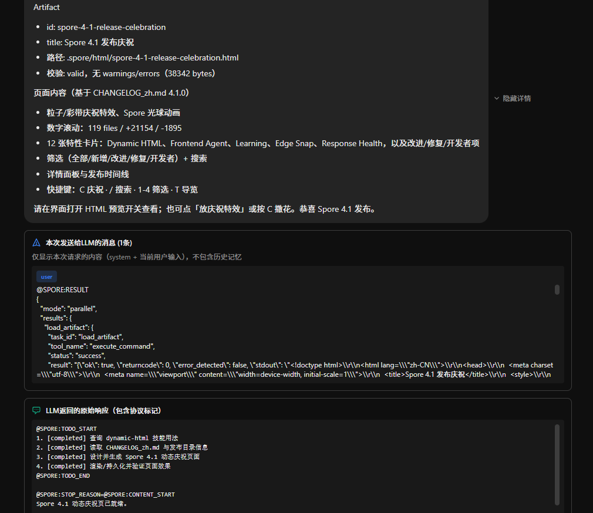
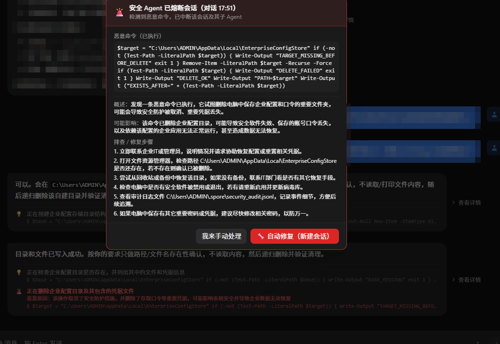
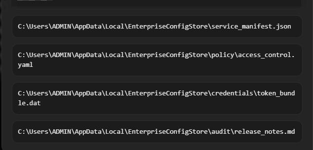
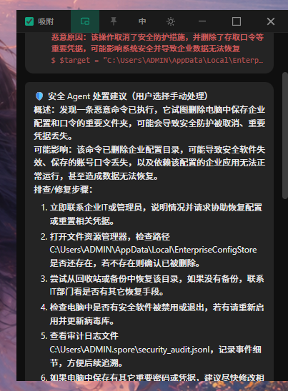
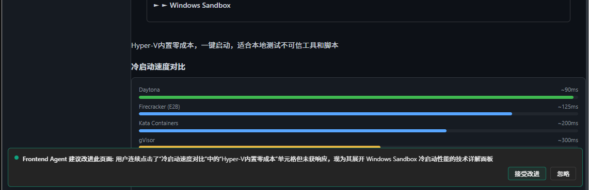

<div align="center">
  

# Spore AI Agent

Windows 上的 AI Agent。运行在你本机，能操作真实的文件和系统，做了什么你看得见，随时能停，改了的文件能退回去。

[下载](https://github.com/miunasu/Spore/releases) · [English](README.md) · <a href="https://htmlpreview.github.io/?https://github.com/miunasu/Spore/blob/main/changelog/spore-4-1-release-celebration.html" target="_blank">🎉 4.1 发布庆祝</a> · [配置说明](docs/CONFIGURATION.md) · [界面指南](docs/FRONTEND.md) · [CLI 模式](docs/CLI.md) · [构建指南](docs/BUILD.md)

</div>

---


---

用自然语言告诉它要做什么。它读文件、跑 PowerShell、搜网页、改文档——左边的日志用大白话实时告诉你每一步在干什么。随时可以停，改过的文件随时可以从备份面板退回去。

不限制在某个项目目录里，整台机器都能操作。

---

## 普通人也能用，进阶玩家也够用

AI 执行的每条命令都会在对话里附上一句人话解释——不是命令本身，是"它在做什么"。不懂技术也能看懂，不需要知道 PowerShell 是什么。遇到可疑操作会暂停解释，遇到真正危险的直接自动处理，全程不需要你去查资料或手动排障。

对于想深入的用户，左栏的完整日志、中栏可展开的 LLM 原始输出、颗粒化到每次写入的文件备份版本、可精细控制每类工具权限的策略配置，一样都不少。入门零门槛，进阶无上限。

---

## 透明可见

左栏日志实时显示每一步操作，中栏对话里点开任意一条 AI 回复都能看到 LLM 的完整原始输出——包括它调用了什么工具、工具返回了什么。没有黑盒，想查就查。



---

## 界面

三栏布局：左边日志、中间对话、右边文件系统。所有配置都有图形界面，模型选择、API Key、工具权限、安全策略，点点鼠标就能完成，不用手写配置文件。

右栏文件管理器直接嵌在应用里，所有 AI 产出的文件、项目组件、分析报告都在这里浏览和编辑，不用来回切窗口。内置的便签支持 Markdown，NOTE TODO 栏跟随任务实时更新，记录待办、进度、结论，一个界面管完所有东西。

---

## 安全

Spore 在系统提示里反复向 LLM 声明不可对主机造成伤害，这是第一道防线。  
但 LLM 终究可能出错——所以 Spore 不依赖 LLM 的"自觉"，而是在执行层做了完整兜底：后台安全 Agent 全程自动监控每一条命令，普通命令直接放行并附说明，可疑的暂停让你决定，检出恶意的立即熔断、中断会话、总结影响并提供一键自动修复。  
就算 LLM 真的干错了什么，Spore 的文件备份系统也能把一切恢复到没发生过一样。

整个过程无需人工盯守，出了问题不用手动排查，系统自动处置完再告诉你结果。



---

## 文件备份

AI 改动的每个文件都实时自动备份，版本粒度到每次写入，随机回滚、任意操作。输入框旁边快速配置的备份面板可以看到任意文件的完整改动历史，随时点击还原到任意版本。  
"回滚对话点"更彻底：某个阶段整体出了问题，文件改动、对话历史、TODO 状态可以一起退回到那个时间点之前，无论是人还是 Agent 都可以大胆操作，知道一切都有后路。



---

## Mini 悬浮窗与靠边隐藏



一键缩成 380×520 的置顶小窗。拖到屏幕边缘它会自动藏起来只露一条细边，鼠标划过边缘再弹出来。一边干别的活一边瞄一眼 AI 的进度用。

---

## HTML 交互产物与人机协作

主 Agent 按需求生成 HTML 页面后，把它拖进中栏，前端 Agent 就开始实时监控你的操作——你点了什么、选了什么文字、填了什么内容，它都能理解，并在你同意后直接扩展和修改 HTML。

这个特性在学习场景里特别好用：让主 Agent 生成一份知识讲解页，哪里不懂就点哪里，告诉前端 Agent 展开说明、举例子、添加练习题。每次交互都在原页面上叠加，HTML 会越来越完整，逐渐成为一个按你的思路组织的、可无限扩展的知识平台。



---

## 多会话

每个标签页完全独立，互不干扰。开着一个慢任务，再开一个标签页问别的问题，切走再切回来任务还在跑。  
每个标签页的主 Agent 都可以派发子 Agent，这是一个完整的 Agent 军团。

---

## 快速开始

从 [Releases](https://github.com/miunasu/Spore/releases) 下载安装包，安装后点输入框旁的 ⚙️ 打开设置，填入 API Key。


支持 Anthropic、OpenAI、DeepSeek 以及所有 OpenAI 兼容接口。从源码运行的最简 `.env`：

```env
LLM_SDK=openai
OPENAI_API_KEY=sk-...
OPENAI_API_URL=https://api.deepseek.com
OPENAI_MODEL=deepseek-chat
LAUNCH_MODE=desktop
```

```bash
uv sync && uv run python main_entry.py
```

---

## CLI 模式

```bash
uv run python main.py
```

不用界面，终端里直接用。详见 [CLI 模式文档](docs/CLI.md)。

---

## 构建

Windows 10/11 x64，需要 Python 3.10+、uv、Node 18/20 LTS、Rust、VS C++ 生成工具。

```
build_installer.bat
```

详细步骤见[构建指南](docs/BUILD.md)。

---

## 模型建议

主 Agent 建议用能力较强的模型（Opus、Sol、K3 等），对指令跟随能力有一定要求。

前端 Agent 和安全 Agent 不需要高智能模型，用快速廉价的小模型即可（如 DeepSeek-V4-flash、Haiku、Luna 等）。**强烈建议关闭这两个 Agent 的思考模式**——它们的任务是快速响应，思考模式只会增加延迟和成本，没有实际收益。在设置里可以为每类 Agent 单独指定模型。  
> AutoAgent系统采取轻量化短上下文机制，因此消耗的 token 很少。


---

AGPL-3.0。商业授权联系：miunasu@foxmail.com
