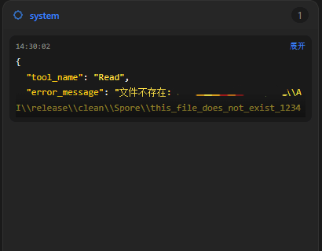
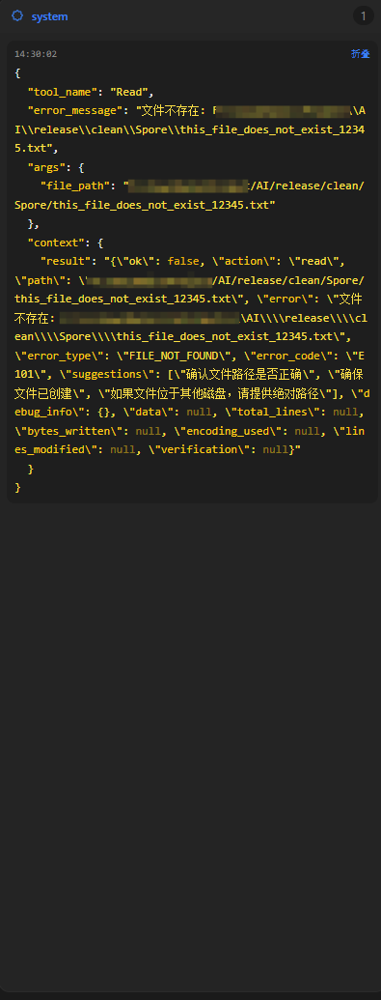
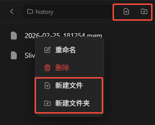
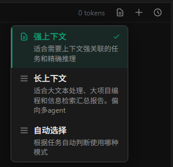
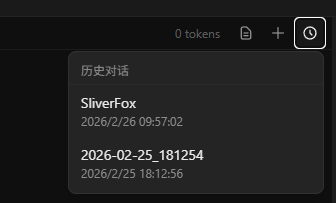
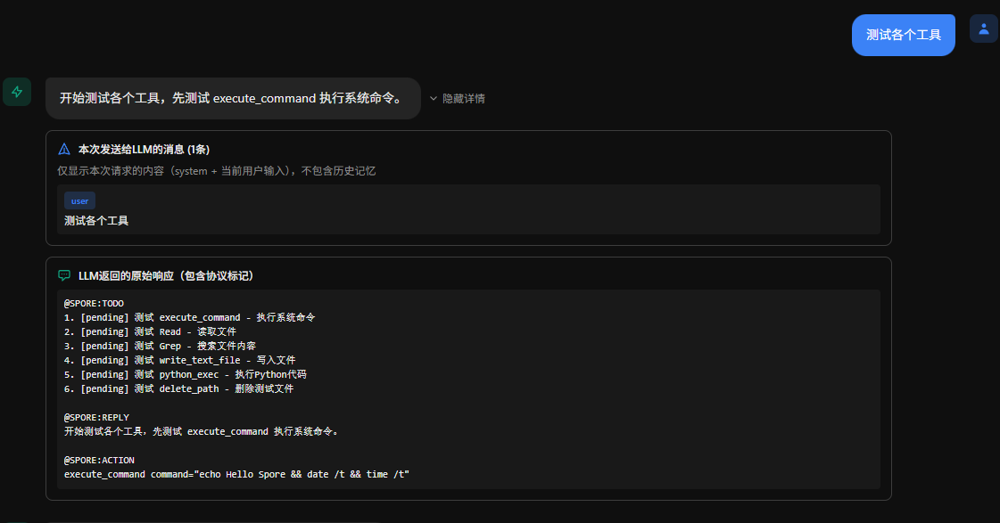
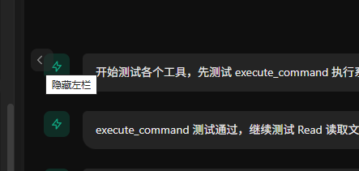
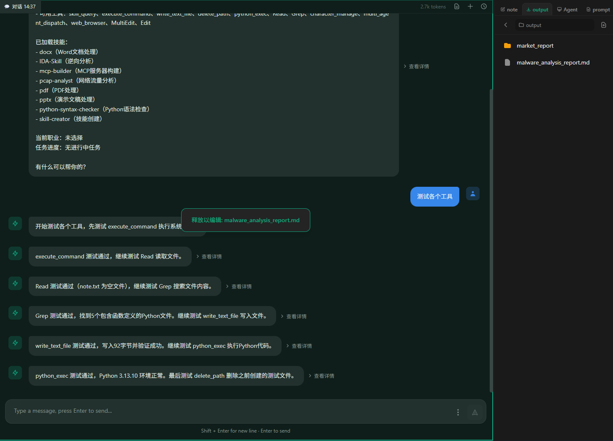
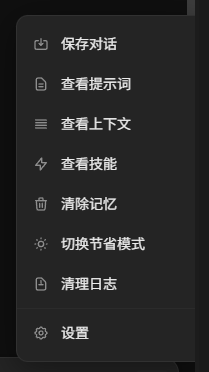

# 前端使用指南

本文档为 Spore 前端使用指南，介绍各个面板的功能和使用方法。

> 💡 **提示**：各面板大小可根据需求自行调整，编辑操作可通过 `Ctrl + S` 快捷保存。

---

## 左栏 - 日志系统

左栏为日志系统，从上到下分别显示：
- 系统报错日志
- Spore 主 Agent 行动日志
- 前端日志

### 查看日志详情

点击任意日志消息的展开以查看详细信息：

### 全屏显示

双击对应日志区域可让该日志系统占据整个左栏，再次双击恢复原状：

---

## 右栏 - 文件管理

右栏提供便捷的文件和子系统管理功能。

### 切换子系统

通过左右拖动滑动条可切换查看不同子系统：

### 文件操作

支持以下文件操作：
- 创建文件或文件夹
- 重命名文件或文件夹
- 删除文件或文件夹

### 文件编辑

- **双击文本文件**：打开查看和编辑
- **双击文件夹**：进入文件夹

---

## 中栏 - 对话与操作面板

中栏是主要的对话和 Agent 操作区域。

### 标题栏

**模式选择与新建对话**

- 选择上下文模式
- 点击加号新建对话

**历史对话**

点击时钟图标可加载已保存的历史对话进行重放：

### 对话栏

对话栏用于显示与 Spore 的交互内容。

点击"查看详情"可了解对话的底层详细信息：

**隐藏侧边栏**

鼠标靠近中栏中间位置时，会显示隐藏左右栏的按钮：

**文件编辑**

可将右栏的文本文件拖入中栏进行查看和编辑：

### 发送栏

发送栏包含三个主要按钮：

- **选项按钮**：进行配置和 Agent 操作
- **发送按钮**：发送消息（也可按 `Enter` 键）
- **中断按钮**：中断 Spore 和所有子 Agent 的当前回复，发送消息进行行为更正，只有对话进行的时候可用

**选项菜单**

**节省模式**

节省模式可减少 token 消耗，实现方式为清除多步骤内容，仅保留用户消息和 Spore 最终回复作为记忆。  

配置说明请查看 [配置文档](CONFIGURATION.md)。

