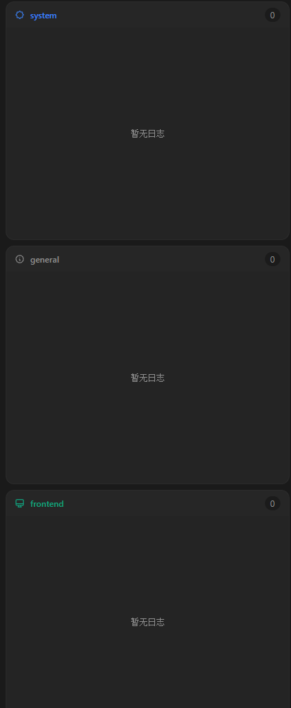
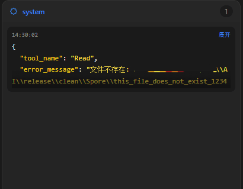
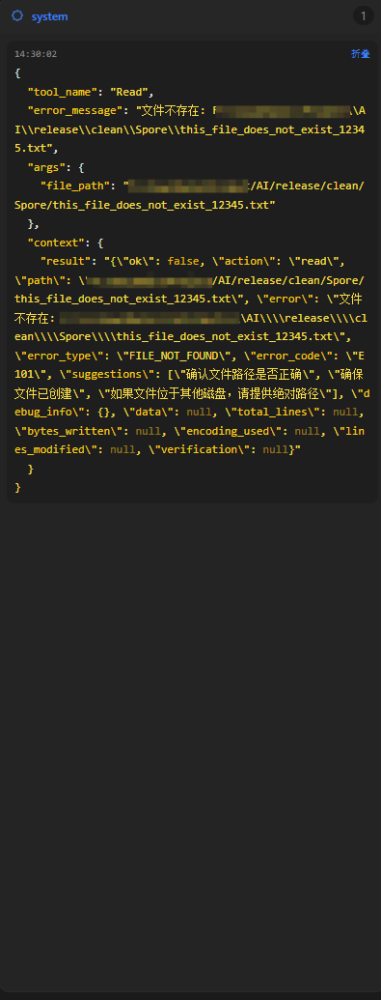
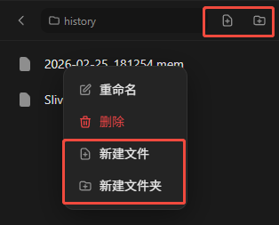
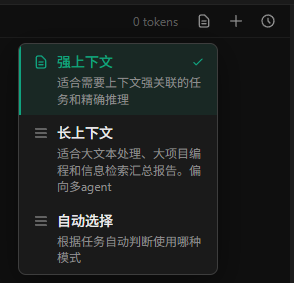
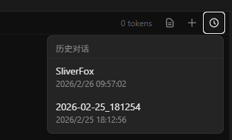
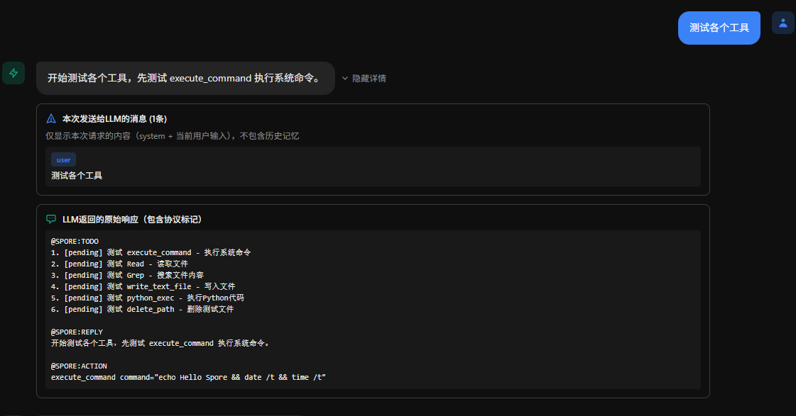
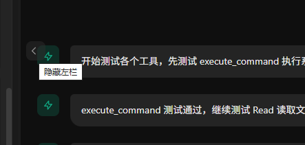
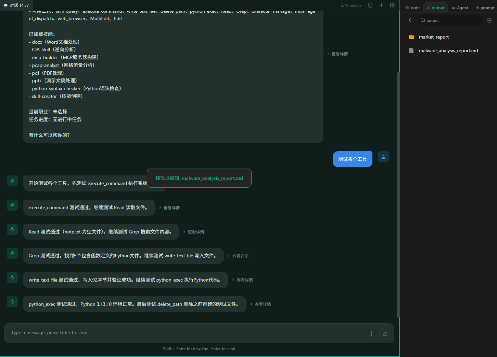
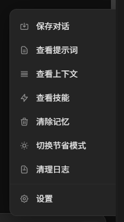

# 前端使用指南（v4.0）

> [English](en/FRONTEND.md)

本文介绍 Spore 桌面前端各面板功能。前端技术栈：React + TypeScript + Zustand + Tailwind + Tauri 1.x（无边框窗口 + Mica 效果）。

> 面板大小可拖拽调整；编辑器可用 `Ctrl + S` 保存。

---

## 整体布局

| 区域 | 功能 |
|------|------|
| 标题栏 | 窗口控制、Mini 模式、窗口置顶、语言切换（中/EN）、主题切换 |
| 左栏 | 日志系统（system / general / frontend） |
| 中栏 | 对话标签页、模式、历史、发送/中断、TODO、确认、安全提示 |
| 右栏 | 文件管理、子系统切换、Agent 监控、便签 |

后端：FastAPI + 独立 WebSocket 推送进程。REST 端口默认 `127.0.0.1:8765`，桌面壳启动时从 `DESKTOP_API_PORT` 动态读取；当前前端 WebSocket URL 固定为 `ws://127.0.0.1:8766`。

每会话有独立 `ConversationLoop` 实例；**任务由后端自驱**——提交后即使切换标签或最小化窗口，任务仍在后台推进，前端只渲染事件流，断线重连后自动恢复状态。

---

## 标题栏

- **Mini 模式**：切换到悬浮小窗（见下文）
- **置顶**：窗口始终置于最前
- **中/EN**：切换界面语言（中文/英文），并同步后端 `SYSTEM_LANGUAGE`（影响命令意图说明、修复建议等辅助输出的语言）
- **主题**：暗色 / 亮色
- 拖拽移动、双击最大化（无边框自定义标题栏）

---

## 左栏 - 日志系统

从上到下可包含：

- **system**：系统 / 校验类报错
- **general**：主 Agent 行动与工具执行摘要（如 `Tool executed successfully`）
- **frontend**：前端自身日志（全局，不按会话隔离）

后端日志（system / general）**按当前对话会话过滤**；WebSocket 用 `conversation_id` 路由。



### 查看详情

点击日志条目展开查看工具调用错误等 JSON 细节：



### 全屏

双击某一日志区域可占满左栏，再次双击恢复：



---

## 右栏 - 文件与监控

### 切换子系统

拖动滑动条可切换视图：**便签（note）/ 输出（output）/ HTML / Agent 监控 / prompt / skills / characters / history**。


### 文件操作

- 创建文件 / 文件夹、重命名、删除、打开所在位置
- 文件管理器中的剪切 / 复制 / 粘贴会真正复制或移动文件，并与 **Windows 资源管理器互通**（原生文件剪贴板，Tauri 实现）
- 对话输入框粘贴资源管理器复制的文件时，只提取真实文件路径并作为路径附件随消息发送；不会把文件复制进工作区，也不会上传或读取文件内容
- 可访问范围为沙箱目录：`output` / `html` / `skills` / `prompt` / `history` / `characters` 及根目录 `note.txt`、`.env`（`prompt/skills/characters` 只读）。虚拟 `html/` 根仅映射 `.spore/html/`，不会开放 `.spore` 的其他数据。



### 打开与编辑

- **双击文本文件**：以标签页形式在中栏编辑
- **双击文件夹**：进入目录
- 可将文件拖入中栏编辑区
- 中栏 **HTML** 开关开启时，`.html` / `.htm` 文件在沙箱 iframe 中渲染；关闭即可查看语法高亮源码

### Agent 监控（v4.0）

「agents」页实时显示运行中的子 Agent（最多 5 个面板）：滚动日志、JSON 美化与语法高亮、按 Agent 自动滚动。数据来自 WebSocket `agent_register/output/status` 事件。

### 便签（v4.0）

「note」页编辑根目录 `note.txt`，`Ctrl+S` 保存，带未保存标记。

---

## 中栏 - 对话与操作

### 标题区：模式与会话

- **模式下拉框**：`strong_context` / `long_context` / `auto`（带图标，作用于当前会话）
- **HTML 开关**：快速启停 Agent HTML 与 HTML 文件的沙箱渲染，状态保存在本机
- **加号**：新建会话（浏览器式标签页，可与文件编辑标签混排）
- **时钟**：历史对话列表（`history/`，支持重命名/删除/加载）
- token 用量统计随对话实时刷新





### 对话区

- 展示用户与 Agent 消息；任务执行中逐轮流式渲染（`round_reply` / 工具调用 / 工具结果）
- 独立完整 HTML 文档或单个 `html` 代码块在开关开启时可交互渲染；关闭时保持为不可执行源码
- 宿主会监控持久 HTML iframe 内可信的点击、输入、变更与提交操作：首个操作开启 5 秒收集窗，将完整时序和元素、控件、DOM 路径及视口上下文交给 Frontend Agent 推断意图；Agent 决定修改时必须先输出 `interrupt`，宿主随即冻结页面，直到收到 `spore:stop_reason`、完成结构化应用、完整校验与重新加载后才解除冻结
- 运行时 Agent 只返回带宿主元素引用的局部 mutation，不返回完整 HTML；后端结构化应用 mutation 并校验合成文档，只有有效变更才会热更新并原子写回 `.spore/html`
- 「查看详情」展开底层 ACTION / RESULT 与发送给 LLM 的原始消息
- 命令意图脚注：安全 Agent（full 模式）会为每条 shell 命令生成一句「它想干什么」的说明，附在对应消息下



靠近中栏边缘可出现隐藏左右栏按钮：



拖拽右栏文件到中栏编辑：



### TODO 栏（v4.0）

Agent 声明式 TODO 通过 WebSocket 推送，按会话显示可折叠的进度条（`✓/✗/○` + 完成百分比）。

### 发送栏

- **选项菜单（⋮）**：设置、角色、拦截开关、节省模式、备份/回滚等（见下文）
- **发送**：Enter 或按钮（输入法安全，Shift+Enter 换行）
- **中断**：停止当前会话回复及子 Agent（仅任务进行中可用）



命令意图与恶意判定现在直接附在对应的 Assistant 消息下；发送区不再挂载旧的 `AgentActivityBar`。Mini 模式同样在消息卡片中显示这些脚注。

### 确认栏与安全弹窗（v4.0）

- **确认栏（ConfirmBar）**：文件删除/覆盖等阻塞式确认；`basic` 安全模式下高危命令的风险确认也在这里出现（默认 `full` 模式下命令不弹确认，全部走异步研判）。多个请求排队处理
- **安全修复弹窗（SecurityRemediationModal）**：安全 Agent 判定命令**恶意**时会熔断当前会话（自动中断 + 终止子 Agent），弹窗展示判定依据与修复建议，可选择：
  - **手动处理**：把建议记录到会话中自行执行
  - **自动修复**：新开一个会话按 `auto_fix_prompt` 自动执行修复任务

### 节省模式（savemode）

减少 token：压缩多步骤中间过程，更偏向保留用户消息与最终回复。与 CLI 命令 `savemode` 同一概念。

---

## Mini 模式（v4.0）

点击标题栏 Mini 按钮进入悬浮小窗（约 380×520，自动置顶，退出时恢复原窗口尺寸、位置、最大化和置顶状态）：

- `MiniModeView` 显示当前会话最近两条 Assistant 回复；若较早消息带有最新命令意图，也会额外固定展示该消息
- 实时显示全部子 Agent 的当前状态和最后一条日志；结束状态由 store 定时移除
- 命令意图与恶意原因仍附在对应消息卡片中
- 输入栏在底部热区悬停、输入聚焦或有待确认请求时浮现；使用与普通模式相同的 `InputArea`，可发送、中断、处理确认及粘贴路径附件
- **仅 Windows** 支持四边吸附：吸附开关默认开启，可在 Mini 标题栏关闭；拖到左 / 右 / 上 / 下屏幕边缘后自动隐藏，鼠标移到对应边缘唤回
- 非 Windows 平台没有原生四边吸附 / 自动隐藏能力

---

## 设置（选项菜单 ⋮）

### 常规

- 主题（暗色 / 亮色）
- 角色 list / select / remove（与 CLI `char` 同源）
- 启动时自动清理短日志等本地偏好

### 环境配置

读写工作目录下的 `.env`（与 [CONFIGURATION.md](CONFIGURATION.md) 同一套变量），并支持配置档案（profiles）。

| 区域 | 说明 |
|------|------|
| **API 配置套** | 顶部：按当前 SDK 保存 / 应用 / 删除 profiles（`base/config_profiles.py`），可一键切换主 Agent 与子 Agent 的整套 Key/URL/模型 |
| **基础配置** | 始终展开；最小可用列表：`LLM_SDK` + 当前 SDK 的 Key / URL / 模型 |
| **高级配置** | 默认折叠；Responses/Thinking、子 Agent 与辅助 Agent 档位、超时、日志、路径、安全与拦截开关等 |

操作：

- **打开 .env**：用系统关联程序打开文件
- **保存配置**：写回 `.env` 并热应用（`/api/settings/env/apply`：重载配置、重启 Chat 进程；能热更新的项立即生效，否则需重启）

### 工具策略（v4.0）

「工具」页可视化开关每个工具乃至**子工具**（如只允许 `file.read` 禁止 `file.delete`；按类型禁用某些子 Agent）：

- 作用域可选 **当前会话** 或 **全局**（全局持久化到 `tool_policy.json`）
- 被禁用的工具会从系统提示中隐藏，且运行时二次拦截
- 支持一键重置为模式默认

### 备份 / 回滚（v4.0）

两个标签页：

- **检查点**：列出当前 session 已创建的两类对话点：`user_message`（CLI 与直接 `/api/chat/send` 路径在加入用户消息后创建；当前桌面 `/api/task/submit` 主路径不会创建）和 `action`（某条 LLM 回复首次实际改动文件时创建）；一键 `rewind` 会恢复文件、截断该 session 对话历史并清空 TODO（该 session 任务生成中会拒绝并提示）
- **文件历史**：仅列出当前 session 跟踪的文件及版本，恢复本身也会记录为新版本
- **共享文件风险**：session 级备份、检查点和自动短记忆彼此隔离，但所有 session 仍操作同一工作区物理文件；并发修改同一路径时，恢复旧版本可能覆盖其他 session 的结果

### Session 备份与历史

每个 session 的短记忆会自动覆盖保存到 `history/autosave/session_<会话ID>.mem`，历史面板可加载这些 autosave；默认最多保留最近约 10 个 session。短记忆被淘汰或手动删除时，对应对话点检查点也会清理。手动保存的 `history/*.mem` 与自动 session 备份分开显示。

### 命令拦截

发送栏选项菜单可快捷切换 `COMMAND_INTERCEPT`（拦截 shell 删除/写文件命令）。

---

## 开发提示

```bash
cd desktop_app/frontend
npm install
npm run dev          # Vite http://localhost:1420
npm run tauri dev    # 带壳调试（自动以 uv 拉起 Python 后端）
```

- 状态管理：`src/stores/*`（chat / editor / agent / todo / confirm / security / log / file / settings / miniMode / drag）
- API 封装：`src/services/api.ts`；WebSocket：`src/services/websocket.ts`（批量事件、30s ping、指数退避重连、重连后快照恢复）
- 国际化：`src/i18n/`（中/英，按组件命名空间组织；`useT()` 响应式取词，语言持久化于 `localStorage`）

更多架构见 [ARCHITECTURE.md](ARCHITECTURE.md)。
