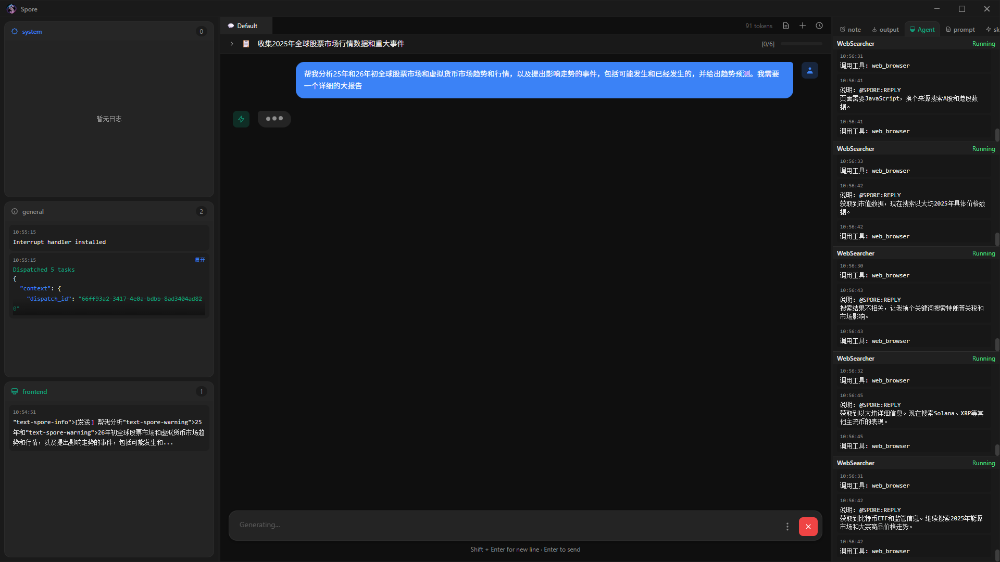

# 2025-2026年全球金融市场综合分析报告

> 报告生成时间：2026年2月26日
> 报告类型：股票市场与虚拟货币市场深度分析

---

## 执行摘要

2025年全球金融市场经历了剧烈波动与结构性变革。股票市场在AI热潮推动下整体上涨，但4月关税冲击导致历史性暴跌后V型反弹；加密货币市场比特币创下$126,198历史新高，机构化进程加速。进入2026年，股市延续上行但分化加剧，加密市场则遭遇"寒冬"，比特币从$88,000跌至$65,000附近，恐惧指数创历史新低。

本报告整合2025全年及2026年初的市场数据，深入分析影响走势的关键事件，并提供趋势预测与投资建议。

---

## 第一部分：2025年全球股票市场回顾

### 1.1 美国股市

#### 三大指数全年表现

| 指数 | 2025年收盘 | 全年涨幅 | 特点 |
|------|-----------|---------|------|
| 道琼斯工业指数 | 48,063点 | +12.97% | 月线八连涨 |
| 标普500指数 | 6,845点 | +16.39% | 连续两年双位数增长 |
| 纳斯达克综合指数 | 23,242点 | +20.36% | 科技股领涨 |

#### 科技七巨头表现

| 公司 | 2025年涨幅 | 驱动因素 |
|------|-----------|---------|
| 谷歌(Alphabet) | +66% | AI搜索、云计算 |
| 英伟达(NVIDIA) | +39% | AI芯片需求 |
| 微软(Microsoft) | +15% | Azure、Copilot |
| Meta | +13% | 广告复苏、AI应用 |
| 特斯拉(Tesla) | +11% | 自动驾驶进展 |
| 苹果(Apple) | +9% | 服务收入增长 |
| 亚马逊(Amazon) | +5% | AWS、电商 |

#### 中概股表现

- 阿里巴巴：+75%（AI转型、云业务）
- 网易：+58%（游戏出海）
- 百度：+55%（文心一言）
- 哔哩哔哩：+36%（用户增长）
- 京东：-15%（竞争加剧）

#### 估值警示

- 标普500席勒市盈率接近40倍，仅次于2000年互联网泡沫
- "美股七巨头"占MSCI全球发达市场指数权重约25%
- 市场集中度风险显著

### 1.2 欧洲股市

| 指数 | 2025年涨幅 | 亮点 |
|------|-----------|------|
| 英国富时100 | +21% | 首次突破10,000点 |
| 德国DAX | +23% | 制造业复苏 |
| 西班牙IBEX 35 | +48% | 欧洲最佳 |
| 希腊雅典综合 | +45% | 新兴欧洲亮点 |

驱动因素：
- 欧洲央行降息预期（累计158个基点）
- 银行、矿业板块强势
- 全球资金寻求对冲美股AI集中风险

### 1.3 亚洲股市

| 指数 | 2025年涨幅 | 特点 |
|------|-----------|------|
| 韩国KOSPI | +75.6% | 全球最佳 |
| 日经225 | +26%~28% | 连续三年上涨 |
| 沪深300 | +21% | 历史性超越美股 |
| 恒生指数 | +20% | 估值修复 |

日本市场驱动：企业盈利增长、日元贬值利好出口、外资持续流入

中国A股：科技板块市盈率仅为美股1/3，估值吸引力显著

### 1.4 2025年股市重大事件

#### 4月关税冲击（历史性暴跌）

- 时间：2025年4月3-4日
- 触发：特朗普"解放日"关税政策
- 道指两日暴跌超4,000点（-9.48%）
- 标普500下跌10%，纳斯达克下跌11%
- 两日市值蒸发6.6万亿美元（创历史纪录）
- 后续：V型反弹，从4月低点至年底上涨近39%

#### 3月美股暴跌

- 纳斯达克单日-4%（两年半最大跌幅）
- 特斯拉年内一度腰斩（-42.9%）
- 原因：关税反复、滞胀担忧、DeepSeek冲击

#### DeepSeek冲击（1月27日）

- 中国AI公司发布低成本高性能模型
- 英伟达单日暴跌17%，市值蒸发5,930亿美元
- 挑战"AI需要昂贵芯片"传统认知
- 中美AI差距缩小至3个月

#### 美联储货币政策

| 时间 | 决策 | 利率区间 |
|------|------|---------|
| 2025年9月 | 降息25bp | 4.00%-4.25% |
| 2025年10月 | 降息25bp | 3.75%-4.00% |
| 2025年12月 | 结束QT | - |

全年累计降息50个基点

---

## 第二部分：2025年虚拟货币市场回顾

### 2.1 比特币(BTC)

#### 关键价格数据

| 指标 | 数值 | 日期 |
|------|------|------|
| 年度最高价 | $126,198 | 2025年10月6日 |
| 年度最低价 | $74,437 | 2025年4月7日 |
| 年度涨跌幅 | -6.33% | - |
| 年度成交额 | 19.35万亿美元 | - |

#### 季度走势

- Q1：$93,000开盘，3月跌至$80,000附近
- Q2：4月7日触及年度最低$74,437，5月突破$100,000
- Q3：7月突破$115,000，8月最高$124,000
- Q4：10月6日创新高$126,198，12月收于$87,500

#### 关键点位

- 强支撑：$74,000-$76,000
- 强阻力：$125,000-$126,000
- 心理关口：$100,000

### 2.2 以太坊(ETH)

| 指标 | 数值 | 日期 |
|------|------|------|
| 年度最高价 | $4,954 | 2025年8月24日 |
| 年度最低价 | $1,387 | 2025年4月9日 |
| 年度涨跌幅 | -10.96% | - |
| 年度成交额 | 10.39万亿美元 | - |

ETH表现弱于BTC，ETH/BTC汇率持续走弱

### 2.3 其他主流币种

| 币种 | 2025年表现 | 亮点 |
|------|-----------|------|
| Solana (SOL) | 强势 | 市值一度超越BNB，生态扩张 |
| XRP | 强劲 | 监管明朗化，目标价$5-$12 |
| BNB | 稳健 | 币安生态持续发展 |

### 2.4 2025年加密市场重大事件

#### ETF里程碑

- 现货ETF资产管理规模突破$1,520亿
- SEC放宽ETF上市标准
- 退休金计划开始允许配置比特币ETF
- 实物申赎机制获批

#### 监管进展

- 美国稳定币立法草案提交（2月）
- 统一监管框架建立
- 128个司法管辖区中58个实施FATF标准

#### 机构化加速

- 机构从投机转向长期持有
- 主权财富基金开始配置数字资产
- 传统金融机构加速布局

#### DeFi与NFT

- DeFi TVL创历史新高：$2,370亿
- 以太坊TVL：$1,190亿
- NFT Q3交易额翻倍至$15.8亿
- 销量飙升至1,810万个

#### 市场总市值

- 突破$4万亿大关
- 比特币市值占比约59%
---

## 第三部分：2026年初市场现状

### 3.1 全球股市（1-2月）

#### 美股三大指数

| 指数 | 当前点位 | 年初表现 | 里程碑 |
|------|---------|---------|--------|
| 道琼斯 | ~48,800点 | 震荡 | 2月6日首破50,000点 |
| 标普500 | ~6,900点 | 上行 | 突破6,900点 |
| 纳斯达克 | ~23,000点 | 波动 | 科技股分化 |

#### 中国A股

| 指数 | 表现 | 特点 |
|------|------|------|
| 上证指数 | 逼近4,100点 | 连续27日成交破2万亿 |
| 深证成指 | +0.21% | 沪强深弱 |
| 创业板指 | -0.40% | 失守3,300点 |

#### 热点板块

领涨：
- 煤炭：+7.66%（印尼削减产量）
- 光伏：+5%~20%（马斯克调研）
- 建筑材料：+3.2%
- 房地产：+2.8%

领跌：
- AI应用/传媒：-3.5%（获利回吐）
- 通信：-2.8%
- 计算机/算力：-2.5%

#### 重大事件

1. 道指突破50,000点（2月6日）
2. DeepSeek一周年影响持续
3. 印尼煤炭政策冲击（削减40%-70%产量）
4. 马斯克调研中国光伏产业链
5. 特朗普关税政策持续扰动

### 3.2 加密货币市场（1-2月）

#### 市场概览

- 总市值：从$3.2万亿跌至$2.24万亿，蒸发近$1万亿
- 恐惧贪婪指数：跌至历史最低5（极度恐惧）
- 24小时最高清算：$9.3亿

#### 比特币表现

| 时间节点 | 价格 | 事件 |
|---------|------|------|
| 1月1日 | $88,000 | 年初开盘 |
| 1月25日 | $87,880 | 首次大跌 |
| 1月29日 | $81,000 | 创2026新低 |
| 2月中旬 | $65,000 | 持续下探 |
| 2月24日 | $63,000-$68,700 | 当前区间 |

- YTD跌幅：约22-23%
- 从历史高点回撤：近50%
- 创2018年以来最差Q1表现

#### 以太坊表现

| 时间 | 价格 | 事件 |
|------|------|------|
| 1月初 | $3,400 | 年初价格 |
| 2月中旬 | $2,300 | 持续下跌 |
| 2月23日 | $1,855-$1,900 | 跌破$2,000 |

重大事件：Vitalik Buterin 2月抛售17,000 ETH（约$1,600万）

#### ETF资金流向

| 指标 | 数据 |
|------|------|
| 1月净流出 | ~$16亿 |
| 连续流出月份 | 4个月 |
| ETF持仓减少 | 约85,000 BTC |
| BlackRock单日最大流出 | $5.23亿 |

#### 逆势上涨币种

| 币种 | YTD涨幅 | 原因 |
|------|--------|------|
| Kite (KITE) | +165% | AI+区块链 |
| STABLE | +117% | 合规稳定币 |
| Morpho | +46% | Apollo合作 |
| Decred | +45% | 隐私需求 |
| LayerZero | +31% | 新L1发布 |

---

## 第四部分：影响市场走势的关键事件分析

### 4.1 已发生的重大事件

#### 宏观经济层面

| 事件 | 时间 | 影响 |
|------|------|------|
| 美联储三次降息 | 2025年9-12月 | 股市受益，债券收益率下行 |
| 特朗普关税战 | 2025年4月 | 两日蒸发6.6万亿美元 |
| 美联储暂停降息 | 2026年1月 | 流动性预期收紧 |
| 就业数据下修86.2万 | 2026年初 | 衰退担忧加剧 |

#### 地缘政治层面

| 事件 | 影响 |
|------|------|
| 俄乌冲突持续 | 能源价格波动，黄金上涨26% |
| 中东局势升温 | 油价飙升，避险情绪上升 |
| 印巴冲突 | 2025年5月导弹事件 |
| 美中关系紧张 | 科技脱钩加速 |

#### 科技产业层面

| 事件 | 时间 | 影响 |
|------|------|------|
| DeepSeek发布 | 2025年1月27日 | 英伟达单日跌17%，AI格局重塑 |
| 比特币ETF实物申赎获批 | 2025年7月 | 机构参与便利化 |
| 多币种ETF获批 | 2025年 | XRP、SOL等进入主流 |

### 4.2 即将发生或可能发生的事件

#### 高概率事件

| 事件 | 预期时间 | 潜在影响 |
|------|---------|---------|
| 美联储继续观望 | 2026年上半年 | 流动性维持紧张 |
| CLARITY Act通过 | 2026年 | 加密监管明确化 |
| "十五五"规划启动 | 2026年 | A股政策支持 |
| 石油供应过剩 | 2026年 | 油价承压 |

#### 风险事件

| 风险 | 概率 | 影响程度 |
|------|------|---------|
| AI泡沫破裂 | 26%投资者认为最大风险 | 科技股大幅回调 |
| 通胀反弹 | 中等 | 美联储被迫加息 |
| 地缘冲突升级 | 中等 | 避险资产飙升 |
| 经济衰退 | 中低 | 全面风险资产抛售 |
---

## 第五部分：趋势预测

### 5.1 股票市场预测

#### 美股

| 机构 | 标普500目标 | 观点 |
|------|------------|------|
| 雅德尼研究 | 7,700点 | 乐观，+11% |
| 高盛 | 6,200点 | 谨慎乐观，+11% |
| 施罗德 | - | 警告大幅回调风险 |
| LPL Financial | - | 连续三年15%+后，次年平均+8%，最大回撤14% |

预测：2026年美股温和上涨5-10%，但波动性上升，板块轮动加速

#### A股

| 券商 | 核心观点 |
|------|---------|
| 国泰海通 | "转型牛"升势远未结束 |
| 中金公司 | 震荡上行，风格均衡 |
| 申万宏源 | 下半年有望启动全面牛 |
| 高盛 | MSCI中国+20%，沪深300+12% |

预测：A股2026年震荡上行，价值与成长均衡，科技与周期轮动

#### 欧洲与亚太

- 欧洲：温和复苏，受益于制造业回暖
- 日本：日元汇率影响波动
- 港股：估值吸引力上升，外资配置需求增加

### 5.2 加密货币市场预测

#### 比特币

| 观点 | 目标价 | 依据 |
|------|-------|------|
| 极度看涨 | $200,000-$250,000 | ETF资金流入、机构采用 |
| 中性看涨 | $150,000 | Bernstein预测 |
| 谨慎 | $70,000-$100,000 | 宏观不确定性 |
| 看空 | $50,000-$60,000 | 若跌破关键支撑 |

关键观察点：
- $60,000支撑能否守住
- ETF资金流向何时转正
- 美联储降息时点

#### 以太坊

- 关键支撑：$1,800
- Vitalik抛售影响市场信心
- 需等待宏观环境改善

#### 市场周期分析

传统四年周期观点：
- 减半驱动上涨
- 2026年可能见顶回落

新范式观点：
- ETF和机构资金改变周期特征
- 牛市可能延长
- 回调幅度可能减小

预测：2026年加密市场先抑后扬，Q1-Q2筑底，下半年有望反弹，比特币年底目标$100,000-$150,000区间

### 5.3 大宗商品预测

| 品种 | 预测 | 驱动因素 |
|------|------|---------|
| 黄金 | $5,000（机构目标） | 地缘风险、避险需求 |
| 石油 | 承压 | 供应过剩、需求疲软 |
| 工业金属 | 分化 | 中国需求是关键 |

---

## 第六部分：投资建议

### 6.1 资产配置建议

#### 股票配置

| 市场 | 建议 | 理由 |
|------|------|------|
| 美股 | 适度配置 | 估值偏高但趋势向上 |
| A股 | 超配 | 估值吸引、政策支持 |
| 港股 | 增配 | 38%估值折价 |
| 欧洲 | 标配 | 温和复苏 |

板块建议：
- 科技：精选AI应用标的，避免高估值
- 周期：关注有色、化工、石油石化
- 防御：银行、煤炭、公用事业（高股息）
- 出海：全球化布局龙头

#### 加密货币配置

| 投资者类型 | 建议配置比例 | 策略 |
|-----------|-------------|------|
| 保守型 | 0-2% | 仅通过ETF参与 |
| 稳健型 | 2-5% | BTC为主，ETH为辅 |
| 激进型 | 5-10% | 可配置部分山寨币 |

当前策略：
- 恐惧指数历史低位，可分批建仓
- 优先选择BTC，通过ETF降低风险
- 关注监管政策变化

#### 其他资产

| 资产 | 建议 | 理由 |
|------|------|------|
| 黄金 | 增配 | 避险需求、目标$5,000 |
| 债券 | 适度增配 | 利率见顶 |
| 现金 | 保持流动性 | 应对波动 |

### 6.2 风险管理

1. 分散投资：跨资产、跨地区、跨行业
2. 动态调整：根据市场变化及时调仓
3. 止损纪律：设定明确止损位
4. 对冲策略：考虑期权等工具对冲尾部风险
5. 流动性管理：保持适度现金比例

### 6.3 关键风险提示

| 风险类型 | 具体风险 | 应对策略 |
|---------|---------|---------|
| 估值风险 | 美股、AI股估值过高 | 分散配置、止盈纪律 |
| 政策风险 | 关税、监管不确定性 | 关注政策动向 |
| 地缘风险 | 俄乌、中东、美中 | 配置避险资产 |
| 流动性风险 | 美联储政策转向 | 保持现金 |
| 周期风险 | 经济衰退可能 | 防御性配置 |
---

## 第七部分：总结

### 7.1 2025年市场回顾要点

股票市场：
- 全球股市整体上涨，韩国KOSPI领涨+75.6%
- 美股三大指数涨幅12%-20%
- 4月关税冲击后V型反弹
- AI主题贯穿全年

加密市场：
- 比特币创$126,198历史新高
- ETF资产规模突破$1,520亿
- 机构化进程加速
- 监管框架逐步完善

### 7.2 2026年初市场现状

股票市场：
- 道指突破50,000点里程碑
- A股连续27日成交破2万亿
- 板块轮动加速，价值周期占优

加密市场：
- 比特币从$88,000跌至$65,000
- 恐惧指数创历史新低5
- ETF连续4个月净流出
- 市场处于"极度恐惧"状态

### 7.3 核心结论

1. 股市：2026年震荡上行概率大，但波动性上升，需关注估值风险和政策不确定性

2. 加密：短期承压，但恐惧指数历史低位往往是长期投资机会，下半年有望反弹

3. 配置：建议股票适度配置（偏向A股、港股），加密小比例参与（2-5%），增配黄金避险

4. 风险：AI泡沫、关税政策、地缘冲突是2026年三大风险因素

---

## 附录：关键数据汇总

### 2025年主要指数涨跌幅

| 市场 | 指数 | 涨跌幅 |
|------|------|--------|
| 美国 | 道琼斯 | +12.97% |
| 美国 | 标普500 | +16.39% |
| 美国 | 纳斯达克 | +20.36% |
| 英国 | 富时100 | +21% |
| 德国 | DAX | +23% |
| 西班牙 | IBEX 35 | +48% |
| 日本 | 日经225 | +26%~28% |
| 韩国 | KOSPI | +75.6% |
| 中国 | 沪深300 | +21% |
| 香港 | 恒生指数 | +20% |

### 2025年加密货币关键数据

| 币种 | 最高价 | 最低价 | 年度涨跌幅 |
|------|-------|-------|-----------|
| BTC | $126,198 | $74,437 | -6.33% |
| ETH | $4,954 | $1,387 | -10.96% |

### 2026年初市场状态（截至2月26日）

| 指标 | 股市 | 加密 |
|------|------|------|
| 整体趋势 | 震荡上行 | 下跌筑底 |
| 市场情绪 | 谨慎乐观 | 极度恐惧 |
| 资金流向 | 分化 | 净流出 |
| 波动性 | 上升 | 高位 |

---

## 数据来源

- 美联储FOMC会议纪要
- SEC加密货币ETF监管公告
- 高盛、摩根士丹利、中金等机构研报
- CoinMarketCap、CoinDesk市场数据
- Bloomberg、Reuters、CNBC新闻报道
- 世界银行大宗商品展望
- 各国央行政策声明

---

*免责声明：本报告仅供参考，不构成投资建议。投资有风险，入市需谨慎。过往表现不代表未来收益。*

*报告完成时间：2026年2月26日*